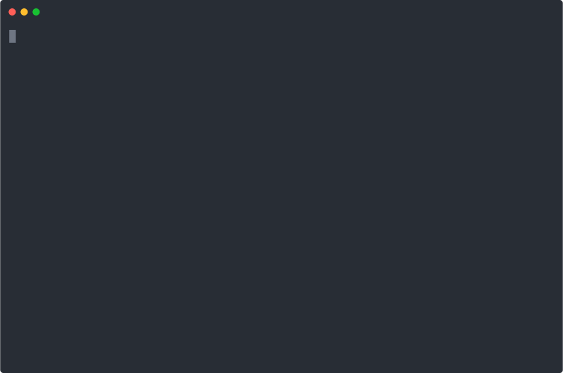

# depmedic


[](https://depmedicdev-byte.github.io/sponsor.html)

[](https://www.npmjs.com/package/depmedic) [](https://github.com/depmedicdev-byte/depmedic/actions/workflows/test.yml) [](./LICENSE)

Surgical npm vulnerability triage. Reads `npm audit --json`, prints the smallest
set of package bumps that close the reported vulnerabilities, ranks them by
severity and reachability, and exits with a CI-friendly code.

`npm audit fix` is too aggressive. Dependabot floods the inbox. Snyk wants an
enterprise contract. depmedic does one thing: tell me the minimum bump that
fixes the real issues, in one screenful, with no breaking surprises.



## Install

```bash
npm install -g depmedic
# or run on demand
npx depmedic
```

Node.js 18+.

## Use

In any project with a `package.json`:

```bash
depmedic                      # human report
depmedic --prod-only          # ignore dev-only vulns
depmedic --severity=high      # only high + critical
depmedic --no-major           # hide fixes that need a semver-major bump
depmedic --json               # machine output for CI
depmedic --input=audit.json   # from a saved 'npm audit --json'
```

Exit codes: `0` clean, `1` vulns present, `2` error. Wire it into CI as a gate.

### Sample output

```
depmedic  2026-04-26T14:00:00.000Z

Found 3 vulnerabilities  [crit 2  high 1  mod 0  low 0]
  fixable: 3   major-bumps: 1   prod-direct: 2

 CRITICAL  mkdirp  (prod-direct)
  affected: 0.4.0 - 0.5.5
  fix: upgrade mkdirp -> 3.0.1 (MAJOR)
  Prototype Pollution in minimist
  https://github.com/advisories/GHSA-xvch-5gv4-984h

 CRITICAL  minimist  (transitive, depth 2)
  affected: <1.2.6
  pulled in via: mkdirp -> minimist
  fix: upgrade mkdirp -> 3.0.1 (MAJOR)

 HIGH  lodash  (prod-direct)
  affected: <4.17.21
  fix: upgrade lodash -> 4.17.21 (patch)
  https://github.com/advisories/GHSA-jf85-cpcp-j695
```

## What it does

- Minimum-bump first. Patch beats minor beats major. Major bumps are flagged
  loudly, never auto-applied.
- Prod vs dev split. `--prod-only` filters dev-only noise.
- Transitive context. Shows which top-level package pulls a vulnerable
  transitive in.
- Single binary. Two runtime deps (`semver`, `picocolors`). No telemetry, no
  dashboards, no account.

## CI

```yaml
- run: npm ci
- run: npm audit --json > audit.json || true
- run: npx depmedic --input=audit.json --severity=high
```

The non-zero exit on findings fails the job.

## Pro

A paid Pro tier is in development:

- Reachability check. Does your code import or call the vulnerable function?
- Monorepo support: pnpm, npm, yarn berry workspaces.
- CI policy file: thresholds, allowlists, expiring suppressions.
- HTML / PDF report.

License via Polar at <https://polar.sh/depmedicdev>. Free CLI stays free.

## Companion tools

- [`ci-doctor`](https://github.com/depmedicdev-byte/ci-doctor) - audit GitHub
  Actions workflows for waste and security gaps.

## Honesty

Built with AI assistance. Every change reviewed. Open an issue if anything
breaks.

## License

MIT. See `LICENSE`.
